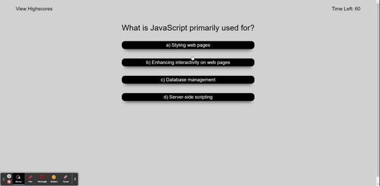

  
# # Unit 04: Web APIs 
JS Quiz Game
javascript Quiz Game with Local Storage of Scores

Hosted App:

https://brxwnsugxr.github.io/ThinkerQuiz-JS-Bootstrap/

**Description**
This is a simple one page web app built to run a quiz, including a timer and score tracking and storage in Local memory. It has been built to be fully responsive, with clean HTML and multiple JS Functions to handle logic.

## Overview:

This week, you'll learn about **application programming interfaces**, or **APIs**, which allow web developers to create dynamic, interactive web applications. An essential part of a developer's toolbox, APIs can help add a wide range of functionality to your code.

APIs are even built directly into the browser. When a webpage is loaded in the browser, an object representation of the webpage (the **Document Object Model**, or **DOM**) is created. As a programming interface, the DOM allows us to use JavaScript to interact with HTML elements.

During class and in this week's homework, you'll practice navigating the DOM. You'll also learn how to create and manipulate HTML elements, add event listeners, create timers, and store data&mdash;all using the power of JavaScript and an API built into the browser itself.

## Key Topics

The following topics will be covered in this unit:

* [Window object](https://developer.mozilla.org/en-US/docs/Web/API/Window)

* [Document Object Model (DOM)](https://developer.mozilla.org/en-US/docs/Web/API/Document_Object_Model)

* [Querying the DOM](https://developer.mozilla.org/en-US/docs/Web/API/Document/querySelectorAll) 

* [Style property](https://developer.mozilla.org/en-US/docs/Web/API/ElementCSSInlineStyle/style)

* [Setting element attributes](https://developer.mozilla.org/en-US/docs/Web/API/Element/setAttribute)

* [Creating DOM elements](https://developer.mozilla.org/en-US/docs/Web/API/Document/createElement)

* [Appending elements](https://developer.mozilla.org/en-US/docs/Web/API/Node/appendChild)

* [Intervals and timers](https://developer.mozilla.org/en-US/docs/Web/API/WindowOrWorkerGlobalScope/setInterval)

* [Event listeners](https://developer.mozilla.org/en-US/docs/Web/API/EventTarget/addEventListener)

* [Keyboard events](https://developer.mozilla.org/en-US/docs/Web/API/KeyboardEvent)

* [Preventing default browser behavior](https://developer.mozilla.org/en-US/docs/Web/API/Event/preventDefault)

* [Stopping propogation](https://developer.mozilla.org/en-US/docs/Web/API/Event/stopPropagation)

* [Local and session storage](https://developer.mozilla.org/en-US/docs/Web/API/Storage)

* [Data attributes](https://developer.mozilla.org/en-US/docs/Learn/HTML/Howto/Use_data_attributes)

## Learning Objectives

You will be employer-ready if you are able to:

* Identify the DOM and its relationship to HTML.

* Select and dynamically generate HTML elements and content using Web API methods.

* Implement DOM API methods to handle events like key presses and mouse clicks.

* Explain event propagation and implement handling functions.

* Store and retrieve data using the browser's local and session storage.

## Technical Interview Preparation

You will be employer-competitive if you are able to solve the following algorithms and successfully complete the assessments.

## Heads-Up

When you are are researching DOM and event resources, you might find jQuery solutions. jQuery is a lightweight JavaScript library that allows you execute JavaScript functionality with just a few lines of code. We'll cover jQuery in the next unit, but for now stick to resources that don't rely on jQuery or the `$` variable.

## Resources

Here are some additional resources to help solidify the topics covered in this unit.
